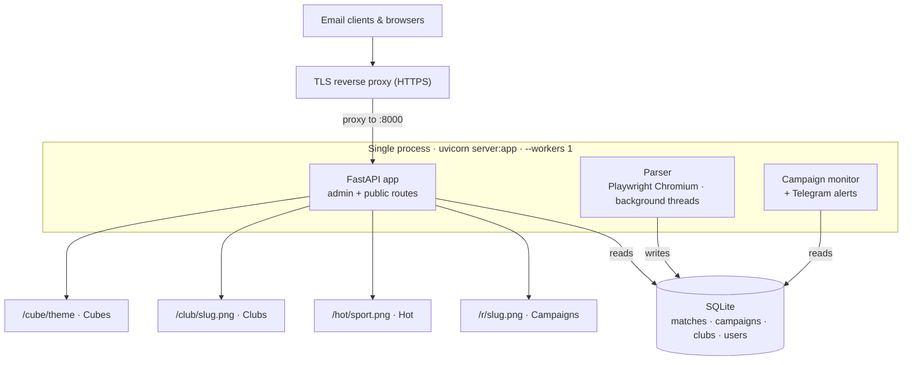

# Live Odds Management

Backoffice and image-rendering service for live sports odds. A background parser
scrapes jugabet.cl, stores every match in a single database, and serves
on-demand PNG images that are embedded in marketing emails and customer
journeys. An admin panel lets operators curate what those images show.

## At a glance

| | |
|---|---|
| **Purpose** | Turn live odds into curated, cache-friendly marketing images (email + journeys). |
| **Core** | One FastAPI process: HTTP app + parser + database + render caches. |
| **Stack** | Python 3 · FastAPI/uvicorn · SQLAlchemy 2 + SQLite · Alembic · Playwright · Pillow · Jinja2 + Alpine.js. |
| **Auth** | bcrypt + JWT cookie sessions, three-tier roles, audit log. |
| **Storage** | Single SQLite database (WAL mode), one `matches` table feeding every render surface. |
| **Deploy** | systemd-managed uvicorn behind a TLS reverse proxy on a VPS. See [DEPLOY.md](DEPLOY.md). |
| **Maturity** | Production, single-tenant, single-process by design. See [Project status](#project-status--design-notes). |

---

## System architecture

The whole service runs as **one process**. A single `uvicorn server:app
--workers 1` owns the HTTP app, the parser, the SQLite connection, and the
in-memory image caches. Everything renders from one `matches` table.



**Why one process:** the parser keeps a single shared Chromium worker and the
renderers depend on in-process PNG caches. Running more than one uvicorn worker
would spawn duplicate parsers, contend on SQLite, and break local cache
invalidation. A pidfile guard enforces the singleton; `--workers 1` is the rule.
Splitting the parser into its own service is the planned next step (see
[Project status](#project-status--design-notes)).

---

## What it produces

There are four public, cache-friendly image surfaces, each independent of the
others and all rendered from the same `matches` table:

| Surface | URL | What it renders |
|---|---|---|
| Campaigns | `/r/{slug}.png` | A hand-picked (manual) or league-filtered (auto) list of matches with odds. The main email asset. |
| Hot | `/hot/{sport}.png` | The auto-ranked hottest matches for a sport, admin-reorderable. |
| Clubs | `/club/{slug}.png` | A single team's next upcoming match. Pure PNG, one per club slug. |
| Cubes | `/cube/{theme}.png` (plus `.gif`, `/widget`, `/data.json`) | A promotional 3D-cube unit that auto-picks matches by hot score. |

Campaigns also carry the journey URL used in emails:
`https://<host>/r/{slug}.png?limit=N&v={{JourneyActivityId}}&u={{playerID}}`.

---

## Repository layout

```
server.py                 Production entry point: FastAPI app + the parser threads
app/
  config.py               All settings (env-overridable). See "Configuration" below.
  database.py             Session factory and the db_session() context manager
  models/                 SQLAlchemy models (Match, Campaign, Club, User, ...)
  repositories/           Data-access layer (CampaignRepository, UserRepository, ...)
  routes/                 HTTP routes: admin_*.py (panel) and public_*.py (images)
  services/               Rendering engine, hot engine, telegram_notify, campaign_monitor
  parser/                 Feed parsing + extra-feed management
  render/                 Shared rendering helpers (logos.py: disk cache + initials fallback)
  templates/              Jinja2 admin pages (base.html is the shared shell)
  static/                 redesign.css (the live design system), favicon, admin bundle
scripts/                  Operational CLI tools (see "Scripts" below)
alembic/                  Database migrations
deploy/                   systemd unit, reverse-proxy config, runbooks, deploy scripts
```

Note: the various `*_render_server.py` and `server_v2.py` files at the repo root
are legacy or standalone rendering harnesses, useful for isolated template work.
The live service is `server.py` on port 8000; production never runs the others.

---

## Quick start (local development)

```bash
# 1. Virtualenv + dependencies
python -m venv .venv
source .venv/bin/activate        # Windows: .venv\Scripts\activate
pip install -r requirements.txt
playwright install chromium      # one-time, for the parser

# 2. Initialize the database (creates the SQLite file + runs migrations)
python scripts/init_db.py

# 3. Create the first admin account
python scripts/create_admin.py --username admin1 --role admin

# 4. Run the app
uvicorn server:app --host 127.0.0.1 --port 8000 --workers 1
```

Then open `http://127.0.0.1:8000/admin/login`.

Always run with `--workers 1` (see [System architecture](#system-architecture)).
To run without the parser for UI-only work, set `PARSER_ENABLED=false`.

---

## Operations quick reference

For a service deployed per [DEPLOY.md](DEPLOY.md) (systemd unit `jugabet`):

| Need | Command |
|---|---|
| Is it alive? | `curl -s localhost:8000/health` → expects `{"ok": true, ...}` |
| Service status | `systemctl status jugabet` |
| Restart | `systemctl restart jugabet` |
| Live logs | `journalctl -u jugabet -f` (or the files under `LOG_DIR`) |
| Deploy an update | `git pull --ff-only && ./deploy/deploy.sh` (snapshots DB, migrates, restarts, health-checks) |
| Post-deploy verify | `python scripts/phase_b_health.py` |

Service name, paths, and proxy details are owned by [DEPLOY.md](DEPLOY.md) and
[deploy/STAGING_RUNBOOK.md](deploy/STAGING_RUNBOOK.md) — treat those as the
source of truth over any older notes.

---

## Configuration

Settings live in `app/config.py` and can be overridden with environment
variables (a `.env` file is loaded automatically; start from
[.env.example](.env.example)). The common ones:

| Variable | Default | Purpose |
|---|---|---|
| `APP_ENV` | `development` | `production` enables stricter startup checks (fails fast on unsafe secrets/cookies/hosts). |
| `DATABASE_URL` | local SQLite file | Database connection string. |
| `PARSER_ENABLED` | `true` | Set `false` to run the UI without scraping. |
| `PARSER_REFRESH_SECONDS` | `120` | How often each feed re-parses. |
| `MATCH_DEACTIVATE_AFTER_HOURS` | `12` | When a stale match is marked inactive. |
| `JWT_SECRET_KEY` | placeholder | Must be set to a long random string in production. |
| `COOKIE_SECURE` | `false` | Set `true` in production (HTTPS only). |
| `ALLOWED_HOSTS` | localhost set | Comma-separated hostnames allowed to serve. |
| `TELEGRAM_BOT_TOKEN` | empty | Bot token for campaign-health alerts (from @BotFather). |
| `TELEGRAM_CHAT_ID` | empty | Chat id alerts are sent to (from @userinfobot). |
| `CAMPAIGN_MONITOR_ENABLED` | `true` | Master switch for the campaign monitor. |
| `CAMPAIGN_MONITOR_INTERVAL_SECONDS` | `300` | How often the monitor runs. |
| `CAMPAIGN_STALE_MINUTES` | `20` | Data older than this counts as "dead". |
| `ADMIN_LOGIN_MAX_ATTEMPTS` | `5` | Failed logins before a temporary lockout. |
| `ADMIN_LOGIN_LOCKOUT_MINUTES` | `15` | Lockout duration. |

Real secrets are never committed. `.env` is gitignored.

---

## The admin panel

Sign-in is at `/admin/login`. The sidebar adapts to the signed-in user's role,
so each operator only sees pages they can open.

### Roles and permissions

Hierarchy: `admin` > `editor` > `viewer`. Each role inherits everything below it.

| Capability | Viewer | Editor | Admin |
|---|:---:|:---:|:---:|
| View dashboard, matches, hot, cubes, weights, clubs, campaigns, live parses | yes | yes | yes |
| Edit campaigns, hot, cubes, weights, clubs | no | yes | yes |
| Delete / duplicate / bulk-delete campaigns | no | yes | yes |
| Delete clubs | no | yes | yes |
| Parser Links, Journey Cloner | no | yes | yes |
| Logs page | no | no | yes |
| Tutorial management (upload / delete) | no | no | yes |

Watching tutorials (the Help button) is available to every signed-in user.

### Pages

- Dashboard: parser status and quick stats.
- Matches: every match the parser has seen, searchable.
- Campaigns: create and manage the `/r/{slug}.png` assets (manual or auto).
- Hot: per-sport ranking, with pin / suppress / reorder overrides.
- Journey Cloner: tooling to spin up email-journey drafts.
- Parser Links: extra league or tournament feed URLs the parser pulls.
- Live Parses: live per-feed health, computed from the database (not a guess).
- Weights: tune the hot-score formula per sport.
- Cubes: manage the promotional cube units.
- Clubs: per-team `/club/{slug}.png` definitions.
- Logs: audit trail of admin actions (admin only).

### Account onboarding

Accounts are created with a one-time password (see Scripts). The flow:

1. The operator signs in with the issued password.
2. They are sent straight to the change-password page and confined there until
   they set a new password. The forced change only asks for the new password,
   not the temporary one just used to sign in.
3. After the change they land on the dashboard with a welcome prompt that points
   them at the tutorials. They can watch or dismiss it and keep working.

---

## Account management (scripts)

All run from the project root. On the server, prefix with `.venv/bin/python`.

Create one admin (interactive or with flags):

```bash
python scripts/create_admin.py --username admin1 --role admin
```

Create operator accounts with generated one-time passwords:

```bash
# interactive: pick a role once, then type usernames
python scripts/new_user.py

# batch
python scripts/new_user.py --role editor alice bob carol

# re-issue a password for someone who lost theirs
python scripts/new_user.py --reset alice
```

List and remove accounts:

```bash
python scripts/manage_users.py list

# delete specific account(s); dry run, then add --yes to confirm
python scripts/manage_users.py delete --user bob
python scripts/manage_users.py delete --user bob carol --yes

# delete everyone except the named account(s)
python scripts/manage_users.py delete-others --keep admin1 --yes
```

Both delete commands refuse to run if a named account does not exist, or if the
deletion would leave no active admin, so an operator cannot be locked out.
Without `--yes` they only preview.

---

## The parser

`server.py` starts one parser thread per feed inside the main process, driven by
a single shared Playwright Chromium worker. Each feed re-parses every
`PARSER_REFRESH_SECONDS`. A watchdog respawns dead feeds. A lightweight
priority-odds HTTP loop keeps featured leagues (campaign / hot / World Cup) fresh
even when the heavy browser feeds are slow.

Extra feeds (specific leagues or tournaments) are managed from the Parser Links
page and stored in `data/parser_extra_feeds.json`.

Matches that drop out of the feed are marked `is_active = false`. A match still
flagged live but not refreshed within the stale window is treated as finished by
downstream logic.

---

## Campaign health monitor (Telegram)

When `TELEGRAM_BOT_TOKEN` and `TELEGRAM_CHAT_ID` are set, a background monitor
(running only in the parser-holding process, so workers do not double-alert)
checks every enabled campaign on an interval and:

- Sends a red alert when a campaign's data goes dead (its league has no live
  matches, or its picked matches went stale or were removed), and a green alert
  when it recovers. Alerts fire only on state changes, not every cycle.
- Auto-disables a manual campaign whose every picked match has finished
  (inactive, removed, or frozen-stale), so it stops rendering blank, and sends a
  one-time notice. Empty-by-design campaigns are left alone.

The monitor loop also runs the auto-disable pass when Telegram is unconfigured;
the alerts simply become no-ops. The "Test Telegram alert" button on the Parser
Links page confirms the bot credentials work.

---

## Useful operational scripts

| Script | Purpose |
|---|---|
| `scripts/init_db.py` | Create the database and run migrations. |
| `scripts/create_admin.py` | Create or update one admin/operator. |
| `scripts/new_user.py` | Create operators with generated one-time passwords. |
| `scripts/manage_users.py` | List, delete, or prune accounts. |
| `scripts/import_tutorial.py` | Add a tutorial video from the server (bypasses upload size limits). |
| `scripts/reset_hot.py` | Clear hot overrides for a sport. |
| `scripts/phase_b_health.py` | Deep health check: DB, public JSON/PNG endpoints, club + legacy render parity. |
| `scripts/test_all_endpoints.py` | Smoke-test every endpoint against a running server. |

Several `scripts/probe_*.py` and `scripts/capture_*.py` files are parser
investigation tools, not part of normal operations. `scripts/wipe_matches.py` is
destructive (it deletes `matches` and `campaign_matches`) and should be used with
care.

---

## Deployment

Production runs on a VPS behind a TLS-terminating reverse proxy, which forwards
to uvicorn on port 8000, managed by systemd. A routine update is a pull plus a
guarded deploy:

```bash
cd /home/admin/<app-dir>
git pull --ff-only origin <branch>
./deploy/deploy.sh        # snapshots the DB, installs deps, migrates, restarts, health-checks
```

First-time setup, backups, monitoring, and rollback are in [DEPLOY.md](DEPLOY.md).
The staging procedure is in [deploy/STAGING_RUNBOOK.md](deploy/STAGING_RUNBOOK.md),
which is the source of truth for hostnames and service names.

---

## Project status & design notes

Honest current state, for anyone evaluating or inheriting the system:

- **Single-process by design.** The web app, parser, and database share one
  process. This is deliberate (shared Chromium worker, in-process caches) and
  works well at the current single-tenant scale. The main architectural ceiling
  is throughput: the next serious upgrade is splitting the parser into its own
  systemd service (`web` + `parser`), not adding queues or Postgres.
- **SQLite is intentional.** WAL-mode SQLite is sufficient for this workload and
  keeps operations simple (file-level backups, no separate DB server). Postgres
  is not needed yet.
- **Security posture.** Production config fails fast on unsafe JWT secret,
  insecure cookies, missing allowed hosts, or non-HTTPS public URL. Auth has a
  role hierarchy, forced first-login password change, login rate-limiting, and
  anti-enumeration behavior. The systemd unit is hardened (`NoNewPrivileges`,
  `PrivateTmp`, `ProtectSystem`, memory limits, restart-on-failure).
- **CI.** A GitHub Actions workflow ([.github/workflows/ci.yml](.github/workflows/ci.yml))
  runs on every push: a compile check, the standalone parser/deactivation tests
  (`scripts/test_embedded_odds.py`, `scripts/test_deactivate_not_seen.py`), and a
  from-scratch Alembic migration. Converting the remaining `scripts/test_*.py`
  smoke checks into `pytest` coverage is the next testing step.
- **Known follow-ups.** Legacy root-level render servers and `server_v2.py`
  remain imported as render harnesses (`render_hot_png`) and would need a small
  refactor before they could move to a `legacy/` directory.

---

## Conventions

- Many small, focused files over a few large ones.
- All user input is validated at the route boundary; database access goes through
  the repository layer.
- Admin actions are recorded in the audit log.
- Renderers share `app/render/logos.py` for logo caching and fallback.
- The three image systems (Campaigns, Hot, Clubs) are intentionally independent
  and must not be merged.
